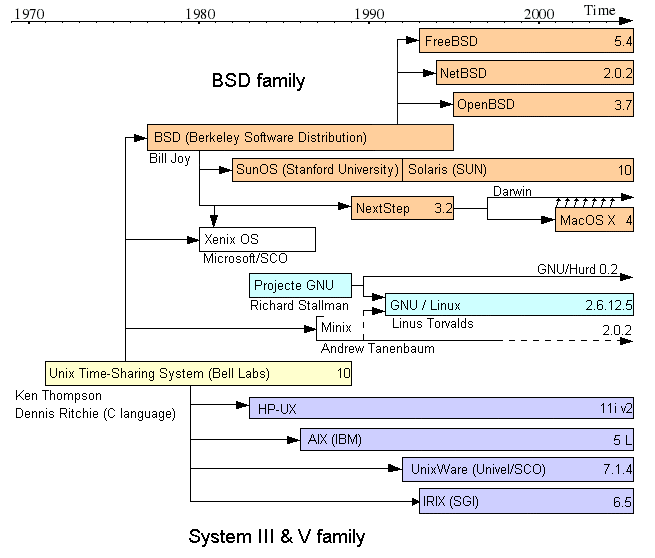

# linux-commands

This README describes many commonly used linux commands.

## Table of Contents

* [Prerequisites](#prerequisites)
* [Overview](#overview)
* [Working with Directories](#working-with-directories)
* [Special Path Specifiers](#Special-Path-Specifiers)
* [Linux Help](#Linux-Help)
* [Creating, Copying and Moving Files and Directories](#Creating,-Copying-and-Moving-Files-and-Directories)
* [Examining File Contents](#Examining-File-Contents)
* [Redirecting Output](#Redirecting-Output)
* [System Status](#System-Status)
* [Additional Commands](#Additional-Commands)


## Prerequisites

All examples in this document require the files in this [repository](https://help.github.com/en/github/creating-cloning-and-archiving-repositories/about-repositories) to be available on your local machine.

Open a terminal screen on your machine and download the repository to your machine.

```bash
git clone https://github.com/m-matthews/linux-commands.git
```

The local file structure under `linux-commands` will look similar to:


## Overview

Linux Commands are the common way of interacting with a Unix like machine.  Many do not have graphical user interfaces and only a terminal/text based interface.  Others are termed 'headless' where there is no attached monitor or keyboard, and remote access via a Terminal is the only way to interact with the devices (examples include Web Servers, Docker containers and Robots).

The following diagram from [Wikipedia](https://commons.wikimedia.org/wiki/File:Unix_timeline.en.png) shows the history of Unix Like machines, including Linux and Mac OS:



To follow the exercises in this tutorial, start the Terminal application if it is not already.  The prompt will usually end with a `$` depending on the default shell setup.

If you type the following command into the Terminal and press `[ENTER]` you will see an example of using the command `echo` with the parameter `"Hello World"`:

```bash
echo "Hello World"
```

The remainder of this document covers many of the useful commands, usually with only one or two examples to show the type of functionality provided.  Further details and examples can be found by using your favourite search engine.


## Working with Directories

There are a number of commands that are useful in working with directories on Unix like systems.

> The terms directory and folder are similar and in this document considered the same.

Assuming the `git` command above has just been executed, you can change your path to that folder with `cd`:

```bash
cd linux-commands
```

Your prompt will most likely change to indicate your current working directory (depending on your configuration and shell), however this can also be viewed with the command `pwd`:

```bash
pwd
```

This should display in your terminal something like `/home/<your-login>/linux-commands`.

The next step is to list the files in this folder:

```bash
ls
```

A more detailed list can be seen with the following (where `-als` are *options* provided to the command `ls`):

```bash
ls -als
```

It is also possible to list the contents in other folders without using `cd` to relocate first.  The next example lists the contents of the subfolder `data`:

```bash
ls data
```

The `find` command enables you to list the contents of folder and subfolders with the one command:

```bash
find
```

It is possible to limit the output to files matching a specific pattern (in this case all files ending in `.txt`:

```bash
find . -path *.txt
```

> Commands covered so far:  `cd`, `find`, `ls` and `pwd`.


## Special Path Specifiers

| Specifier | Description | Example |
| --------- | ----------- | ------- |
| `.`       | The current directory | `ls ./data` returns the same results as `ls data`, however in some situations the `.` is important. |
| `..`       | The parent directory | `ls ..` will list the contents of the parent folder. |
| `~`       | The current user's home folder. | `cd ~/linux-commands` will set the current working directory to the folder relative to your home location, regardless of the current working directory. |
| `*`       | Wildcard substitution with any characters. | `ls ./data/*.csv` will list all files ending in `.csv` in the `data` subfolder. |
| `?`       | Wildcard substitution with any single character. | `ls data/*.?sv` will list files ending in values such as `.csv` and `.tsv` which are the standard extensions for comma and tab separated value files respectively. |

> Special path characters of `.`, `..`, `*`, `?` and `~` have been covered.


## Linux Help

Every command in Linux includes a help manual in the form of `man <command>`.

To find help on the `ls` command and all of the options available:

```bash
man ls
```

The `spacebar` moves forward through the display, or `q` can be pressed to quit (along with other options).  More details are available by typing:

```bash
man man
```

A brief description is also available with `whatis <command>`:

```bash
whatis pwd
```


## Creating, Copying and Moving Files and Directories

This section covers creating and deleting files and directories, along with copying and renaming them.

To create a directory:

```bash
mkdir test
```

To copy files into the new directory:

```bash
cp README.md test
cp README.md test/other.md
```

To rename files use the `mv` command (think `m`o`v`e rather than rename):

```bash
mv test/other.md test/newname.md
```

To create an empty file, you can use the `touch` command.  This can also be used to set the modified date of an existing file to the current time:

```bash
touch test/empty.md
```

Deleting a file is done with the `rm` command:

```bash
rm test/newname.md
```

As with many commands you can use wildcards to remove many files:

```bash
rm test/*.md
```

Finally, the directory can be removed with the `rmdir` command:

```bash
rmdir test
```


## Examining File Contents

The `data` folder contains sample data suitable for testing the examination of various files.  The following command changes to that folder to simplify the remainder of the examples:

```bash
cd data
```

The `cat` command displays the contents of a file in the terminal window:

```bash
cat ACT_2019-01.csv
```

Note that `cat` displays **all rows** of the file which may not be suitable with large files:

```bash
cat ACT_combined.csv
```

To view just the first part of the file the `head` command is handy.  In this case you can review the start of the file to work out the names of the columns in the CSV file:

```bash
head ACT_combined.csv
```

It is also possible to control the number of lines display with the `-n` option:

```bash
head -n 4 ACT_combined.csv
```

The `tail` command shows the end of a file:

```bash
tail ACT_combined.csv
```

To view the contents of a large file one page at a time the `more` command can be used:

```bash
more ACT_combined.csv
```

The `less` command is a newer version of `more` that allows backward movement in the display:

```bash
less ACT_combined.csv
```

In addition to viewing the contents of files it is also possible to update and filter them.

The `sort` command sorts the file into alphabetical order.  Note that the heading line is considered just another line of text and move to the middle of the file.  This will be fixed in a later example:

```bash
sort names.csv
```

The `spell` command does simple spell checking and returns rows with issues:

```bash
spell -n spelltest.txt
```

It is also possible to do a quick word and line count with the `wc` command:

```bash
wc data/spelltest.txt
```

Similar to the `git diff` command, `diff` enables you to view the difference between multiple files:

```bash
diff spelltest.txt spelltest2.txt
```

The `grep` command is useful for pattern matching in files to extract the relevant information.

The following example extracts each line containing the name `Filby`:

```bash
grep "Filby" time_traveller.txt
```

The `-i` option searches in a case insensitive mode:

```bash
grep -i "machine" time_traveller.txt
```

The following search looks for lines where the word `Why` is followed by `Time`:

```bash
grep "Why.*Time" time_traveller.txt
```

The final search covers multiple files looking for the same pattern in each:

```bash
grep "2019/04/01" *_combined.csv
```

The `awk` command enables powerful data processing.  It processes files line by line, splitting each line into fields and can perform various filters and actions.  It can transform files to produce reports and also summarisations.

The first example extracts the first column from `names.csv` to display:

```bash
awk -F ',' ' {print $1}' names.csv
```

The second example uses `tail` (skipping the header row) to sum all values in the data:

```bash
tail -n +2 NSW_combined.csv | awk -F',' '{ val += $3 } ; END { print "Total: " val }'
```

The `sed` command is a serial editor that enables you to edit files without needing to open them in an editor.  This is useful with very large files or where an editor is not available:

The first example simply replaces all `,` characters with `;` in a given file:

```bash
sed 's/,/;/g' names.csv
```

The second example converts a file to uppercase:

```bash
sed -e 's/.*/\U&/' names.csv
```

The third example deletes the first line (the header):

```bash
sed 1d names.csv
```

The final example converts the string `NSW` into `N.S.W.`:

```bash
sed 's/NSW/N.S.W./g' NSW_2019-01.csv
```

Sometimes files are too large to be processed by other software tools.  In this case it can be useful to `split` them into smaller files.

This first example will `split` the input file into files of 200 lines each, with the output filename starting with `NSW_split_`:

```bash
split NSW_combined.csv -l 200 -d NSW_split_
```

The second example will `split` the input file into files of 2K size each, with the output filename starting with `NSW_split_2k_`:

```bash
split NSW_combined.csv -b 2K -d NSW_split_2k_
```


## Redirecting Output

It is possible to redirect output from a command to a file or another command.

| Symbol | Description | Example |
| ------ | ----------- | ------- |
| `|`    | The Pipe allows output from one command to be 'piped' into another. | `ls -als | more` |
| `>`    | This symbol allows the output of a command to go to a file rather than the display. | `sed -e 's/.*/\U&/' names.csv > uppercase.csv` |
| `>>`    | This symbol allows the output of a command to be **appended** to an existing file rather than the display. | `ls -als >> filelists.txt` |
| `<`    | This symbol allows the input of a command to come from a file. | `command < file` |

For example the following command sorts the entire file, and the header is now displayed in the sorted results:

```bash
sort names.csv
```

The file can be sorted properly by using the following commands.  Note that the `>` sends the output to a file, while `>>` appends to the file:

```bash
head -n 1 names.csv > sortednames.csv
tail -n +2 names.csv | sort >> sortednames.csv
```

The results can now be viewed with:

```bash
cat sortednames.csv
```

Note that this can also be performed in a single operation to the screen using the following commands, where the `()` characters join the output separated by `&&`):

```bash
(head -n 1 names.csv && tail -n +2 names.csv | sort)
```

It is also possible to send the output from one command to another using `|`.  In this case the output of `sort` is passed through `more` to enable paged based viewing of the results:

```bash
sort ACT_combined.csv | more
```

> Redirection symbols of `>`, `>>` and `|` have been covered in this section.


## System Status

The following commands provide functionality useful for viewing the current system's status.

The amount of time this machine has been running:

```bash
uptime
```

The list of running processes using the most resources:

```bash
top
```

> Use `Ctrl-C` to stop any command including `top` (or simply press `q` for `top`).

A list of processes relating to your login:

```bash
ps
```

As an example of a running process, the following command will wait for 3 seconds and then return:

```bash
sleep 3
```

To make any process run in the background you can add the `&` symbol at the end.  This way you could continue other shell commands while the process is running.  You will see a Process ID displayed after executing this command:

```bash
sleep 30 &
```

The same Process ID (`PID` column) can be seen by using:

```bash
ps
```

> Note that `ps -ef` will provide additional tasks that are not related to your login.

To stop any background process you can use the `kill` command, using that Process ID:

```bash
kill <process-id>
```
> WARNING: Killing the wrong Process may leave you with an unstable system so use this command with extreme care.

> Note that some processes will not stop and require `kill -9 <process-id>` which is similar to the **Force Quit** option.

Available space on disks is able to be viewed with the `df` command.  Note that this also requires and understanding of the filesystem on your current device:

```bash
df
```

Alternatively the `du` command lists the size of **Disk Usage**.

```bash
du
```


## Additional Commands

The following are a collection of miscellaneous commands.

To determine if a given server or service is available to you, use the `ping` command:

```bash
ping wikipedia.org
```

The `ssh` command will allow you to securely connect to a server.  Note that this requires assistance from your administrator to provide appropriate accounts and instructions:

```bash
ssh <server>
```

The `who` and `whoami` commands help to remind you of your current connection login details:

```bash
who
whoami
```

If `nano` is installed, you will have access to a powerful editor which works well in a text based window:

```bash
nano names.csv
```

The `chmod` and `chown` commands enable you to change the permissions and ownership of files.

Finally, a terminal window or connection is usually closed with the `exit` command:

```bash
exit
```
