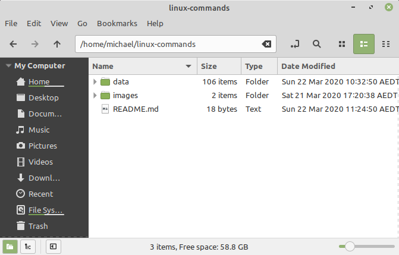
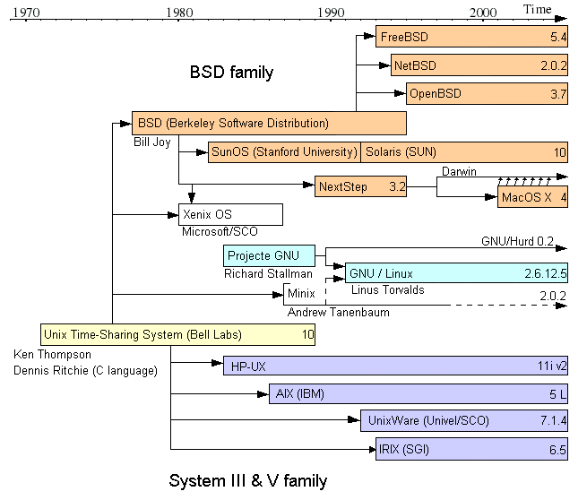

# images

## folder-structure.png

> The initial folder and file structure when this repository is cloned to local machine.

## Unix_timeline.en.png

> The file `Unix_timeline.en.png` is sourced from [Wikipedia](https://commons.wikimedia.org/wiki/File:Unix_timeline.en.png) as an image in the [public domain](https://en.wikipedia.org/wiki/en:public_domain).
